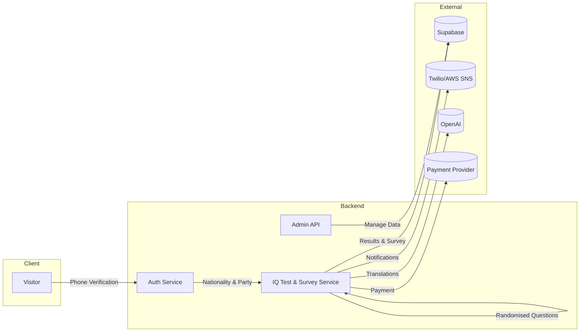

# Architecture Overview

This document provides a high‑level view of the IQ Test With Political Preference application. It describes the major components, data flow, and the relationships between the services used across the stack.

### Components

- **Frontend** – React SPA served by Vercel. Handles user interactions for phone verification, nationality and party selection, IQ testing, survey submission, and displaying results.
- **Backend** – FastAPI application hosted on Render. Exposes REST endpoints consumed by the frontend. Business logic is organised into routers and services with Supabase repositories.
- **Supabase** – Stores users, questions, survey responses, parties and IQ results. Acts as the authentication provider.
- **Twilio / AWS SNS** – Sends one‑time passwords for phone verification and system notifications.
- **OpenAI** – Provides translation for survey content and notifications.
- **Payment Provider** – Handles optional donations and monetisation flows.

### Request Flow

1. **Phone Verification** – User enters phone number; backend sends OTP via Twilio/AWS SNS. Supabase stores verification state.
2. **Nationality & Party Selection** – Frontend retrieves available nationalities and parties from Supabase via backend APIs.
3. **IQ Test Execution** – Backend serves randomised questions. Answers are recorded and an IQ score is computed.
4. **Survey & Results** – User completes a follow‑up survey. Results and optional payments are stored, and notifications are dispatched.
5. **Admin Dashboard** – Administrators access aggregated data and manage question pools and survey content.

This diagram will be kept up‑to‑date as refactoring progresses to ensure new modules and flows remain documented.
